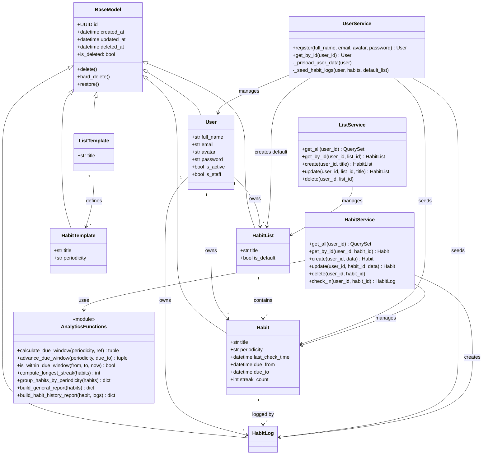

# Class Diagram — Core Domain

```mermaid
classDiagram
    class BaseModel {
        +UUID id
        +datetime created_at
        +datetime updated_at
        +datetime deleted_at
        +delete()
        +hard_delete()
        +restore()
        +is_deleted: bool
    }

    class User {
        +str full_name
        +str email
        +str avatar
        +str password
        +bool is_active
        +bool is_staff
    }

    class HabitList {
        +str title
        +bool is_default
    }

    class Habit {
        +str title
        +str periodicity
        +datetime last_check_time
        +datetime due_from
        +datetime due_to
        +int streak_count
    }

    class HabitLog {
    }

    class ListTemplate {
        +str title
    }

    class HabitTemplate {
        +str title
        +str periodicity
    }

    class UserService {
        +register(full_name, email, avatar, password) User
        +get_by_id(user_id) User
        -_preload_user_data(user)
        -_seed_habit_logs(user, habits, default_list)
    }

    class ListService {
        +get_all(user_id) QuerySet
        +get_by_id(user_id, list_id) HabitList
        +create(user_id, title) HabitList
        +update(user_id, list_id, title) HabitList
        +delete(user_id, list_id)
    }

    class HabitService {
        +get_all(user_id) QuerySet
        +get_by_id(user_id, habit_id) Habit
        +create(user_id, data) Habit
        +update(user_id, habit_id, data) Habit
        +delete(user_id, habit_id)
        +check_in(user_id, habit_id) HabitLog
    }

    class AnalyticsFunctions {
        <<module>>
        +calculate_due_window(periodicity, ref) tuple
        +advance_due_window(periodicity, due_to) tuple
        +is_within_due_window(from, to, now) bool
        +compute_longest_streak(habits) int
        +group_habits_by_periodicity(habits) dict
        +build_general_report(habits) dict
        +build_habit_history_report(habit, logs) dict
    }

    BaseModel <|-- User
    BaseModel <|-- HabitList
    BaseModel <|-- Habit
    BaseModel <|-- HabitLog
    BaseModel <|-- ListTemplate
    BaseModel <|-- HabitTemplate

    User "1" --> "*" HabitList : owns
    User "1" --> "*" Habit : owns
    User "1" --> "*" HabitLog : owns
    HabitList "1" --> "*" Habit : contains
    Habit "1" --> "*" HabitLog : logged by
    ListTemplate "1" --> "*" HabitTemplate : defines

    UserService --> User : manages
    UserService --> HabitList : creates default
    UserService --> Habit : seeds
    UserService --> HabitLog : seeds
    ListService --> HabitList : manages
    HabitService --> Habit : manages
    HabitService --> HabitLog : creates
    HabitService --> AnalyticsFunctions : uses
```
